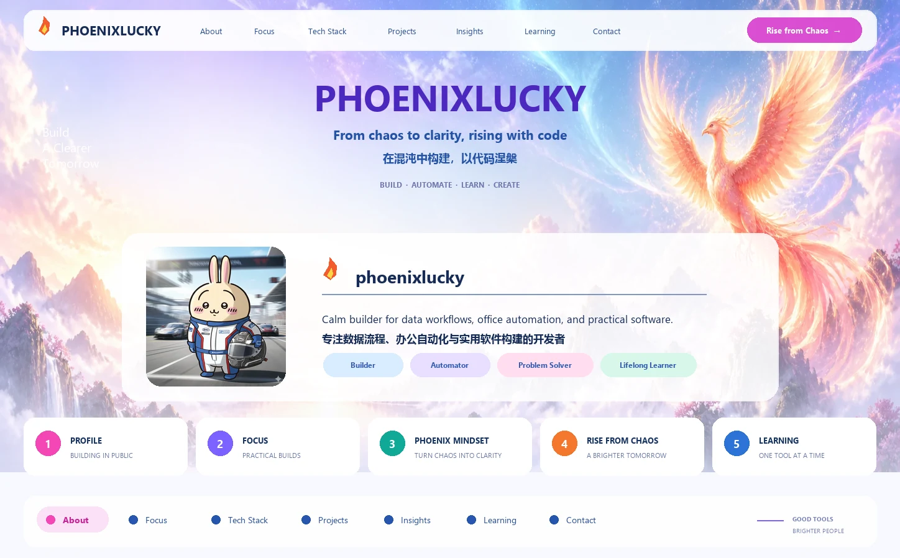

  <a href="#-about">🔥 About</a> ·
  <a href="#-focus">✨ Focus</a> ·
  <a href="#-tech-stack">🧰 Tech Stack</a> ·
  <a href="#-featured-projects">💡 Projects</a> ·
  <a href="#-github-insights">📈 Insights</a> ·
  <a href="#-learning-now">🌱 Learning</a> ·
  <a href="#-contact">📫 Contact</a>

## 🔥 About

<table width="100%">
  <tr>
    <td width="27%" align="center" valign="middle">
      
    </td>
    <td valign="middle">
      <h3>Calm builder for useful software</h3>
      
我专注于数据流程、办公自动化与实用软件构建，把混乱的工作整理成可复用、可维护的系统。

      
I build tools that reduce repetitive work and turn messy processes into reusable systems.

      

        
        
        
      

    </td>
  </tr>
</table>

<table width="100%">
  <tr>
    <td valign="top" width="33%">
      <strong>📌 Role</strong> 
      Data analyst · Full-stack practitioner · Toolmaker
    </td>
    <td valign="top" width="33%">
      <strong>🎯 Style</strong> 
      Calm and systematic · Practical over flashy
    </td>
    <td valign="top" width="33%">
      <strong>💭 Interests</strong> 
      Python tooling · Office automation · Interface polish
    </td>
  </tr>
</table>

## ✨ Focus

<table width="100%">
  <tr>
    <td valign="top" width="50%">
      <h3>🤖 Automation First</h3>
      
把重复的办公和数据任务沉淀成稳定、可复用的小工具。

      Small dependable tools for repetitive work.
    </td>
    <td valign="top" width="50%">
      <h3>🎨 Useful Interfaces</h3>
      
工具不仅要完成任务，也要在交互上顺手、舒服。

      Functional software with a little design warmth.
    </td>
  </tr>
  <tr>
    <td valign="top" width="50%">
      <h3>🏗️ Practical Engineering</h3>
      
优先选择能长期维护的代码与结构，而不是一次性的临时方案。

      Maintainable structure over one-off tricks.
    </td>
    <td valign="top" width="50%">
      <h3>🌏 Bilingual Sharing</h3>
      
用中英双语整理想法，让好用的经验更容易复用和传播。

      Ideas documented for broader reuse.
    </td>
  </tr>
</table>

## 🧰 Tech Stack

  <strong>Languages</strong> 
  
  
  
  
  

  <strong>App & Web</strong> 
  
  
  
  
  

  <strong>Data, AI & Tools</strong> 
  
  
  
  
  
  

## 💡 Featured Projects

<table width="100%">
  <tr>
    <td valign="top" width="50%">
      <h3><a href="https://github.com/phoenixlucky/zerotoken-skill">zerotoken-skill</a></h3>
      
Token-efficient AI coding discipline for Reasonix / Codex / OpenCode / Hermes.

      
压缩无效上下文、推理与输出，约束权限边界与执行纪律。

      
      
    </td>
    <td valign="top" width="50%">
      <h3><a href="https://github.com/phoenixlucky/mcp-chrome-2026">mcp-chrome-2026</a></h3>
      
Chrome extension-based MCP server for browser automation and content analysis.

      
把浏览器能力开放给 AI 助手，支持自动化与语义搜索。

      
      
    </td>
  </tr>
  <tr>
    <td valign="top" width="50%">
      <h3><a href="https://phoenixlucky.github.io/tao-of-strategy/">韬略之道 · Tao of Strategy</a></h3>
      
A quiet collection of strategy ideas, organized around six complementary themes.

      
古代兵法格言聚合站，每日一面随机呈现。

      
      
    </td>
    <td valign="top" width="50%">
      <h3><a href="https://github.com/phoenixlucky/wei-data-shu">wei-data-shu</a></h3>
      
A Python toolkit for office automation, databases, Excel, files, text and AI.

      
面向办公自动化和数据处理的 Python 工具库。

      
      
    </td>
  </tr>
</table>

More projects

  <a href="https://github.com/phoenixlucky/moon-lovers-skill">moon-lovers-skill</a> ·
  <a href="https://github.com/phoenixlucky/weiliaozi-skill">weiliaozi-skill</a> ·
  <a href="https://github.com/phoenixlucky/financial-analyst-skill">financial-analyst-skill</a> ·
  <a href="https://github.com/phoenixlucky/business-data-analyst-skill">business-data-analyst-skill</a> ·
  <a href="https://github.com/phoenixlucky/TrendForecasting">TrendForecasting</a> ·
  <a href="https://github.com/phoenixlucky/WeiScheduler">WeiScheduler</a> ·
  <a href="https://github.com/phoenixlucky/WeiPython">WeiPython</a> ·
  <a href="https://github.com/phoenixlucky/clean_safe_plus">clean_safe_plus</a>

## 📈 GitHub Insights

  

## 🌱 Learning Now

> 🔥 What burns out can be rebuilt. What is learned becomes the next foundation.
>
> 烧尽的可以重燃，学到的成为下一块基石。

<table width="100%">
  <tr>
    <td valign="top" width="33%"><strong>🎯 Interaction</strong> Front-end visualization and interaction clarity</td>
    <td valign="top" width="33%"><strong>🧠 Fundamentals</strong> Algorithm fundamentals and implementation quality</td>
    <td valign="top" width="33%"><strong>📦 Delivery</strong> Better developer and office productivity tools</td>
  </tr>
</table>

## 📫 Contact

  

🔥 Rise from chaos, build with clarity, ship with warmth. 
于混沌中涅槃，以清晰构建，用温度交付。

